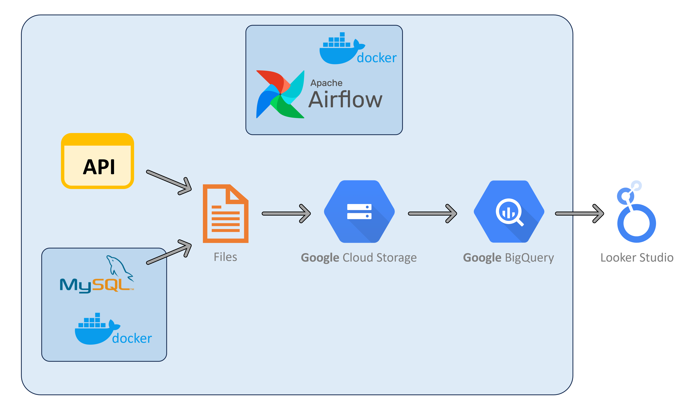
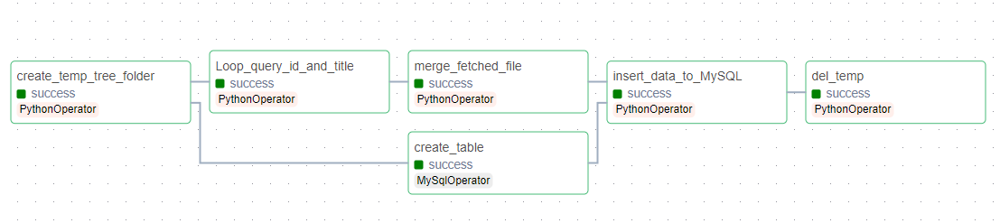
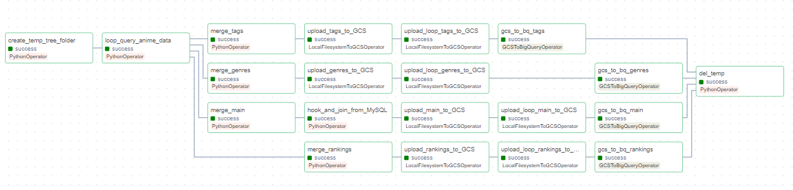
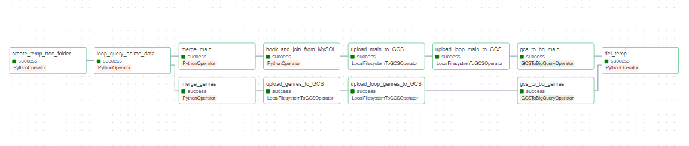
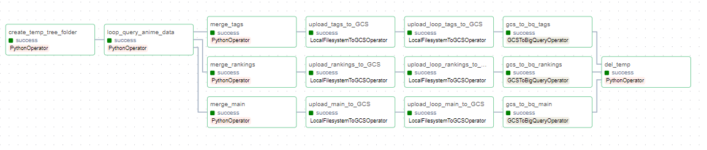
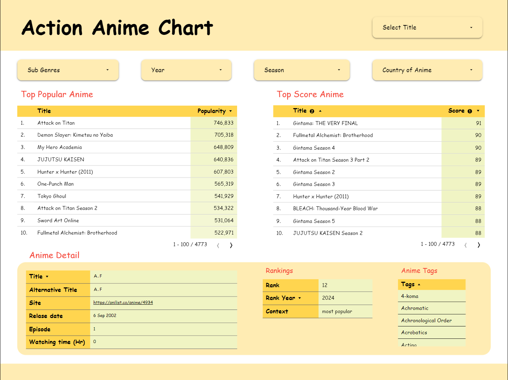
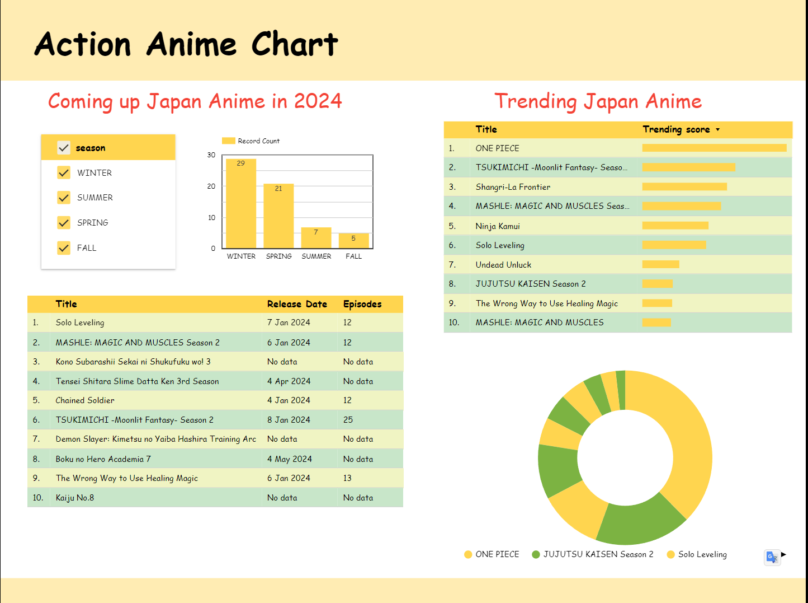

# Action Animation Chart

This project demonstrates a development process for ETL batch processing. It utilizes Airflow and MySQL running on Docker to transfer data from a GraphQL API to Cloud Storage and BigQuery (GCP). The data is then visualized using Looker Studio.

## Data Source:

The data originates from the GraphQL API of the AniList website (AniList: http://anilist.co/), a rich source of anime and manga information. You can explore the API details here: Link: https://github.com/AniList/ApiV2-GraphQL-Docs.

## Project Pipeline

<p align="center">
  
</p>

# Content

- [Action Animation Chart](#action-animation-chart)
  - [Data Source:](#data-source)
  - [Project Pipeline](#project-pipeline)
- [Content](#content)
- [Getting Started](#getting-started)
  - [Docker Set Up](#docker-set-up)
  - [Building MySQL Container](#building-mysql-container)
  - [Docker Bridge Network](#docker-bridge-network)
  - [Building Airflow Docker Compose](#building-airflow-docker-compose)
  - [Airflow Connection Configuration](#airflow-connection-configuration)
    - [MySQL Connection](#mysql-connection)
    - [GCP Connection](#gcp-connection)
- [Running Airflow DAGs](#running-airflow-dags)
  - [ID\_and\_English\_title\_fetch](#id_and_english_title_fetch)
  - [Main\_data\_fetch](#main_data_fetch)
  - [Separate\_main\_fetch](#separate_main_fetch)
  - [Daily\_score\_fecth](#daily_score_fecth)
- [Visualization on Looker Studio](#visualization-on-looker-studio)

# Getting Started

## Docker Set Up

Before we begin, ensure you have Docker installed on your machine. You can download Docker Desktop from the official website: Link: https://docs.docker.com/get-docker/.

## Building MySQL Container

1. Navigate to the `mysql` folder within the project directory:
    
    ```bash
    cd mysql
    ```
    
2. Build the MySQL container image using the provided Dockerfile (you can adjust the version within the Dockerfile).
    
    ```bash
    docker build -t mysql:8.3 .
    ```
    
    **Explanation**:
    
    - `mysql` is image name
    - `8.3` is image tag
3. Build MySQL container with volume mount for upload data to MySQL
    
    ```bash
    docker run -d --name mysql_con -v ~/your/local/path:/var/lib/mysql-files/ -e MYSQL_ROOT_PASSWORD=yourpassword mysql:8.3
    ```
    
    **Explanation**:
    
    - `mysql_con` is the container name.
    - `yourpassword` is your MySQL root password.
    - `~/your/local/path` is the local directory that will be mounted as a volume within the container, allowing you to load data for table creation.
    - `mysql:8.3` is the MySQL image.
4. Verify the MySQL container is running:
    
    ```bash
    docker ps
    ```
    
5. To interact with the MySQL container using SQL commands, run:
    
    ```bash
    docker exec -it mysql_con bash
    ```
    
    Then, log in to MySQL using the root password:
    
    ```bash
    mysql -u root -p
    ```
    
6. Check if the database has been created successfully:
    
    ```bash
    show databases;
    ```
    
    If `anime_db` (as defined in the Dockerfile) appears, proceed to the next step (Docker Bridge Network).
    
7. To stop the MySQL container:
    
    ```bash
    docker stop mysql_con
    ```
    

## Docker Bridge Network

To connect between MySQL and Airflow, we need to create a bridge network.

1. Create a bridge network named `mysql_airflow_bridge` (can change to any name):
    
    ```bash
    docker network create -d bridge mysql_airflow_bridge
    ```
    
2. Verify network creation:
    
    ```bash
    docker network ls
    ```
    
3. Connect the network to the MySQL container (`mysql_con`):
    
    ```bash
    docker connect mysql_airflow_bridge mysql_con
    ```
    
4. Confirm the connection:
    
    ```bash
    docker inspect mysql_airflow_bridge
    ```
    
    The container name (`mysql_con`) should be listed under "Containers".
    
    ```bash
    "Containers": {
                "...": {
                    "Name": "mysql_con",
                    ...
    ```
    

## Building Airflow Docker Compose

In this project, Airflow will run within a Docker Compose environment using a custom image you create. This image pulls the official Airflow image and required libraries from your `requirements.txt` file. Refer to the Airflow official documentation for details: https://airflow.apache.org/docs/

1. Navigate to the `airflow` folder:
    
    ```bash
    cd airflow
    ```
    
2. Build the Airflow image using the Dockerfile:
    
    ```bash
    docker build -t apache/airflow:2.8.1 .
    ```
    
    **Explanation**:
    
    - `apache/airflow` is the image name (replace with your desired name if needed).
    - `2.8.1` is the image tag (update to the Airflow version you're using).
3. Verify the image:
    
    ```bash
    docker images
    ```
    
4. Create the following directories for Airflow to store its working data:
    
    ```bash
    mkdir -p ./logs ./plugins ./config ./data
    ```
    
    - `logs`: Stores Airflow logs.
    - `plugins`: Contains custom Airflow plugins (if any).
    - `config`: Holds Airflow configuration files.
    - `data`: Used for temporary data generated by the pipeline.
    
    **Note:** The `dags` directory, where your Airflow DAGs reside, should already exist.

    
5. Create a `.env` file to store sensitive Airflow environment variables. This assigns a unique user ID (UID) to the Airflow user:
    
    ```bash
    echo -e "AIRFLOW_UID=$(id -u)" > .env
    ```
    
    Append the following lines to your `.env` file to configure Airflow's MySQL connection:
    
    ```python
    MYSQL_HOST = 'mysql_con'
    MYSQL_PORT = 3306
    MYSQL_USER = 'root'
    MYSQL_PASSWORD = 'yourpassword'
    MYSQL_DB = 'anime_db'
    MYSQL_CHARSET = 'utf8mb4'
    ```
    
    **Explanation:**
    
    - `MYSQL_HOST`: The hostname or IP address of your MySQL container (`mysql_con` in this case).
    - `MYSQL_PORT`: The port on which your MySQL server listens (usually 3306).
    - `MYSQL_USER`: The username for MySQL access (usually `root`).
    - `MYSQL_PASSWORD`: The password for the specified MySQL user.
    - `MYSQL_DB`: The name of the MySQL database to use (`anime_db` in this case).
    - `MYSQL_CHARSET`: The character set used by the MySQL database (usually `utf8mb4`).
    
    **Important:** If you modify these environment variable names, update them accordingly in `docker-compose.yaml` by modify the following lines as well.
    
    ```python
    environment:
        ...
        MYSQL_HOST: ${MYSQL_HOST}
        MYSQL_PORT: ${MYSQL_PORT}
        MYSQL_USER: ${MYSQL_USER}
        MYSQL_PASSWORD: ${MYSQL_PASSWORD}
        MYSQL_DB: ${MYSQL_DB}
        MYSQL_CHARSET: ${MYSQL_CHARSET}
    ```
    
    Also with bridge network modify name
    
    ```python
    networks:
      mysql_airflow:
        name: mysql_airflow_bridge
        external: true
    ```
    
6. Initialize your Airflow by type command:
    
    ```bash
    docker compose up airflow-init
    ```
    
    Observe the output in your terminal. It should indicate successful initialization and creation of the default Airflow user (`airflow`).
    
    ```bash
    airflow-init_1       | Upgrades done
    airflow-init_1       | Admin user airflow created
    airflow-init_1       | 2.8.1
    start_airflow-init_1 exited with code 0
    ```
    
7. Start Airflow in detached mode using Docker Compose:
    
    ```bash
    docker compose up -d
    ```
    
8. Open the Airflow web UI in your browser by navigating to http://localhost:8080/ . Log in using the username and password `airflow` . (proceed to **Airflow Connection Configuration** session)
9. If you're done using Airflow, stop it using:
    
    ```bash
    docker compose down
    ```
    

## Airflow Connection Configuration

### MySQL Connection

Go to “Admins” tab and choose “Connections” tab. Click add a new record and fill by below

- Connection Id: mysql_con
- Connection Type: MySQL
- Host: mysql_con
- Schema: anime_db
- Login: root
- Pass: yourpassword
- Port: 3306

### GCP Connection

Before make GCP connection you need to have GCP account. Then create your project, your bucket on Cloud Storage and your dataset on BigQuery. Create a service account key for your project (*Detail by this [link](https://cloud.google.com/iam/docs/keys-create-delete#iam-service-account-keys-create-console)*). Put your key into any airflow can mount (*I put key located in /home/airflow/data*).

Go to “Admins” tab and choose “Connections” tab. Click add a new record and fill by below

- Connection Id: google_cloud_default # must be this name
- Connection Type: Google Cloud
- Project Id: anime-chart-data #your GCP project name
- Keyfile Path: /home/airflow/data/key.json # your json key path
- Scopes (comma separated):  https://www.googleapis.com/auth/cloud-platform
- Number of Retries: 5

**Important:** "*google_cloud_default*" must be this name and "*anime-chart-data*" is your GCP project name

# Running Airflow DAGs

This section guides you through executing the Airflow DAGs in this project. If you have a large number of DAGs displayed, filter by the tag "Data Eng. project" to find the four relevant ones:

## ID_and_English_title_fetch

<p align="center">
  
</p>

This DAG retrieves anime IDs and English titles specifically for the "Action" genre from AniList. It creates a temporary folder on your local machine, iteratively fetches data, and merges these files into a single file. Meanwhile, an empty table is created in your MySQL database before uploading the data. After completion, the temporary folder is removed.

Note: Using this DAG in this project only for practice my MySQL skill. For best practice you should get English title in same DAG of “*Main_data_fetch”* for lower complexity of your pipeline.

## Main_data_fetch

<p align="center">
  
</p>

This is the core DAG of your pipeline. It starts by creating a temporary folder locally (to avoid incurring GCP API costs for listing Cloud Storage files). The DAG then fetches data using a GraphQL API with a loop query. It separates the data into four tasks: "*main*", "*tags*", "*genres*" and "*ranking*". Only the "main" task is merged with the data previously loaded from MySQL (using the "ID_and_English_title_fetch" DAG). Subsequently, both the merged and individual loop files are uploaded to Cloud Storage (GCS) for backup and processing. Finally, the data is uploaded to BigQuery. The final step involves removing the temporary folder on your local machine.

## Separate_main_fetch

<p align="center">
  
</p>

This optional DAG is designed for daily or weekly scheduled data fetching (currently, the `default_args` are set without a schedule). It resembles the "Main_data_fetch" DAG but retrieves only "main" and "genres" data. The "main" task in this DAG solely extracts string values, with numerical values separated into the "Daily_score_fecth" DAG to minimize the number of tasks in the pipeline. Due to the relatively static nature of this data (anime actions IDs has less frequency change), consider using this DAG in combination with "ID_and_English_title_fetch" for a weekly schedule.

## Daily_score_fecth

<p align="center">
  
</p>

An optional DAG for daily schedule. This DAG fetch about numerical and string data that daily change. Run this DAG everyday will keep your chart to be fresh. And also tasks look same as “*Main_data_fetch”* but split only “*tags”*, “*rankings”*, and “*main”* (numerical data).

This optional DAG is intended for daily scheduled execution. It fetches data that changes daily, consisting of both numerical and string values. Running this DAG daily helps maintain the freshness of your charts. The tasks are similar to "Main_data_fetch," but they split only "*tags*", "*rankings*" and the numerical portion of "*main*" data.

# Visualization on Looker Studio




The images above showcase examples of interactive dashboards you can build using Looker Studio (https://lookerstudio.google.com/). Establish a connection between your BigQuery data source and Looker Studio to unleash your creativity and design your own charts.
